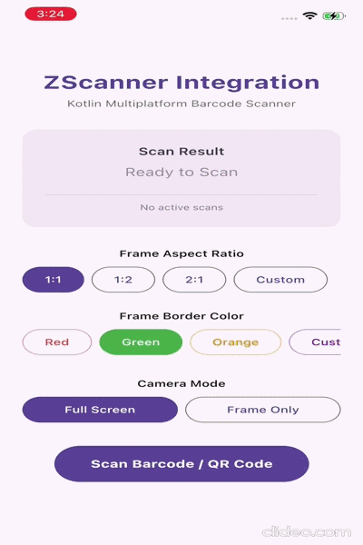

# ZScanner - Kotlin Multiplatform Barcode Scanner

`zscanner` is a modern, premium Kotlin Multiplatform Mobile (KMM) library targeting Android and iOS. It offers high-performance camera barcode scanning using Jetpack Compose and Compose Multiplatform.

---

## 📱 Demo / Preview

| Android Preview | iOS Preview |
| :---: | :---: |
|  |  |

---

## 🌟 Key Features

* **Dual Camera Modes**: Support for both `FullScreen` previews and `FrameOnly` windowed preview modes.
* **Refined Aesthetics**: 
  - Bold, prominent scanner boundary borders (default `5.dp` width).
  - Premium frame-constrained processing overlay.
  - Dynamic HSL-tailored loader glow shadow matching the active frame theme color (Red, Green, Orange, or Custom).
* **Fully Customizable Loader**:
  - Exposes a `@Composable ZScannerCameraScope.() -> Unit` slot.
  - Automatically falls back to the library's internal `DefaultLoader()`.
  - Empowers developers to build custom loading views, overlays, or status indicators seamlessly.
* **Gallery Scan Support**: Fast and direct barcode scanning via photo picker on both Android and iOS with native loading state orchestration.

---

## 📂 Project Structure

* **[`/zscanner`](./zscanner)**: The core library module containing camera preview rendering, barcode detectors, scan overlays, and state controllers.
* **[`/shared`](./shared)**: The shared module for the demo app, housing state models, view models, and the Compose UI configuration panels.
* **[`/androidApp`](./androidApp)**: Android application launcher and container.
* **[`/iosApp`](./iosApp)**: Xcode entry point and SwiftUI wrapper to launch the application on iOS devices.

---

## 🚀 Getting Started

### 1. Basic Usage

Here is a standard integration of the scanner in a Composable function:

```kotlin
import androidx.compose.runtime.Composable
import com.zscanner.ZScannerScreen
import com.zscanner.BarcodeResult
import com.zscanner.permission.rememberZScannerPermissionController

@Composable
fun BarcodeScannerScreen(
    onNavigateBack: () -> Unit,
    onBarcodeScanned: (String) -> Unit
) {
    // Initialize the permission controller
    val permissionController = rememberZScannerPermissionController()

    ZScannerScreen(
        onResult = { result ->
            when (result) {
                is BarcodeResult.Success -> {
                    onBarcodeScanned(result.barcode.data)
                }
                is BarcodeResult.Cancelled -> {
                    onNavigateBack()
                }
                is BarcodeResult.Failed -> {
                    // Handle failure (e.g., log error message: result.message)
                }
            }
        },
        onClose = {
            onNavigateBack()
        },
        permissionController = permissionController
    )
}
```

### 2. Installation

To use `zscanner` in your Compose Multiplatform project, add the dependency to your common module's `build.gradle.kts` (usually `shared/build.gradle.kts` or `composeApp/build.gradle.kts`):

```kotlin
sourceSets {
    commonMain.dependencies {
        // Core KMP scanner library from Maven Central
        implementation("io.github.namantonk:zscanner:1.0.0")
    }
}
```

Make sure you have `mavenCentral()` in your repositories block in `settings.gradle.kts` (which is standard for all Compose Multiplatform projects).

---

### 3. Customizing the Controller & Gallery Scanning

You can configure scanning parameters such as the active camera mode, scan frame ratio, overlay boundary color, and enable gallery barcode scanning.

#### Example: Configuring the Controller and Gallery Picker Callback

```kotlin
import androidx.compose.runtime.Composable
import androidx.compose.ui.graphics.Color
import com.zscanner.ZScannerScreen
import com.zscanner.BarcodeResult
import com.zscanner.ZScannerCameraMode
import com.zscanner.ZScannerFrameRatio
import com.zscanner.rememberZScannerController
import com.zscanner.permission.rememberZScannerPermissionController

@Composable
fun AdvancedScannerScreen(
    onNavigateBack: () -> Unit,
    onBarcodeScanned: (String) -> Unit,
    onLaunchGalleryPicker: () -> Unit // Callback to launch system photo picker
) {
    val permissionController = rememberZScannerPermissionController()

    // 1. Customize your controller properties
    val scannerController = rememberZScannerController(
        cameraMode = ZScannerCameraMode.FrameOnly,      // Use windowed scanner frame instead of full-screen
        frameRatio = ZScannerFrameRatio.Ratio_1_1,      // Set scanning frame to 1:1 aspect ratio
        frameColor = Color(0xFF2196F3),                 // Custom scanner border outline color (Blue)
        showTorchButton = true,                         // Enable/disable flash toggle button
        showGalleryButton = true                        // Enable/disable gallery entry point button
    )

    ZScannerScreen(
        onResult = { result ->
            if (result is BarcodeResult.Success) {
                onBarcodeScanned(result.barcode.data)
            }
        },
        onClose = onNavigateBack,
        permissionController = permissionController,
        scannerController = scannerController,
        // 2. Callback executed when the user clicks the gallery button on the overlay
        onScanFromGallery = onLaunchGalleryPicker
    )
}
```

### 4. Customizing the Loader (Example)

To override the default spinner with a custom loading indicator, simply pass your composable to the `loader` parameter in `ZScannerScreen`:

```kotlin
import com.zscanner.permission.rememberZScannerPermissionController

// Inside your Composable function:
val permissionController = rememberZScannerPermissionController()

ZScannerScreen(
    onResult = { result -> /* handle result */ },
    onClose = { /* handle close */ },
    permissionController = permissionController,
    onScanFromGallery = { /* launch gallery */ },
    loader = {
        // You can run DefaultLoader() or write custom layouts inside ZScannerCameraScope
        Box(
            modifier = Modifier.fillMaxSize(),
            contentAlignment = Alignment.BottomCenter
        ) {
            Surface(
                tonalElevation = 4.dp,
                shape = RoundedCornerShape(16.dp),
                color = MaterialTheme.colorScheme.surfaceVariant,
                modifier = Modifier.padding(bottom = 96.dp)
            ) {
                Text(
                    text = "Analyzing barcode...",
                    modifier = Modifier.padding(horizontal = 24.dp, vertical = 12.dp)
                )
            }
        }
    }
)
```

---

## 🛠️ Verification & Compilation

Validate compilation using the Gradle wrapper:

* **Android Target**:
  ```bash
  ./gradlew :zscanner:compileAndroidMain
  ```
* **iOS Target (Simulator Arm64)**:
  ```bash
  ./gradlew :shared:compileKotlinIosSimulatorArm64
  ```
* **Run Demo Application (Android)**:
  ```bash
  ./gradlew :androidApp:installDebug
  ```